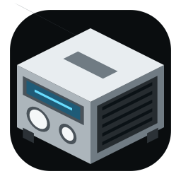
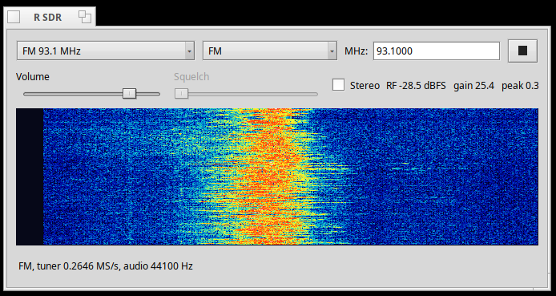

#  Haiku용 R SDR

*[English](README.md) · [문서 목록](../README.ko.md)*



## 설치

R SDR은 Haiku x86_gcc2의 `x86` 보조 아키텍처를 대상으로 해요. RTL-SDR
런타임과 개발 패키지를 먼저 설치하세요.

```sh
pkgman install rtl_sdr_x86 rtl_sdr_x86_devel
```

저장소 루트에서 동봉된 BSAC 디코더를 최초 한 번 빌드한 뒤 설치 스크립트를
실행하세요.

```sh
setarch x86 make -C third_party/bsac
cd haiku
./install.sh
```

앱은 `/boot/home/config/non-packaged/apps/R SDR`에 설치되며 Desktop과 Deskbar
Applications 링크도 만들어져요. 최초 설치 후 Deskbar 링크가 나타나려면
재부팅 한 번이 필요할 수 있어요.

### arm64 (RENKU)

arm64에서는 librtlsdr·libusb·FFmpeg를 함께 담아 미리 빌드한 패키지를
pkgman.rainygirl.com에서 설치할 수 있습니다 (RENKU arm64 이미지에는 저장소가
이미 등록돼 있습니다).

```sh
pkgman install rsdr
```

## 사용법

1. RTL2832U 호환 동글을 연결한 뒤 R SDR을 실행하세요.
2. Preset을 고르거나 Mode를 고른 뒤 주파수를 입력하세요. AM은 kHz, 나머지
   모드는 MHz 단위예요.
3. Play를 누르고 Volume을 조절하세요. Squelch는 AM, Air, LSB, USB 모드에서
   쓸 수 있고 맨 왼쪽으로 옮기면 꺼져요.
4. WFM의 Stereo는 신호가 충분히 강할 때 켜세요. 스펙트럼이나 워터폴을
   클릭하면 해당 주파수로 튜닝돼요.
5. T-DMB는 송출 중인 프리셋을 고르고 자동 게인 탐색이 끝날 때까지 기다리세요.
   Station 목록이 나타나는 데 약 11초 이상 걸릴 수 있어요. 방송국을 고른 뒤
   Play를 누르세요. Haiku 버전은 T-DMB 오디오를 재생해요.

28.8 MHz 아래에서는 Q-branch 직접 샘플링으로 자동 전환돼요. 이 대역을
수신하려면 동글의 Q 입력이 안테나에 연결돼 있거나 별도 HF 입력으로 나와 있어야
해요.

USB 수신이 멈추면 재생을 중지하고 동글을 다시 연결하세요. Haiku의 USB bulk
endpoint가 계속 응답하지 않으면 동글을 물리적으로 뽑았다 꽂은 뒤 다시
재생하세요.

## 라이선스

R SDR의 자체 소스 코드는 [MIT 라이선스](../LICENSE)로 배포돼요.
`third_party/`에 포함된 외부 구성 요소는 MIT로 재라이선스되지 않고,
각 구성 요소의 별도 라이선스를 따라요. 자세한 내용은
[서드파티 고지](../THIRD_PARTY_NOTICES.md)를 참고하세요.

## AI 사용 고지

R SDR의 일부는 AI 코딩 도구(Anthropic Claude)의 도움을 받아 개발했어요.
모든 코드는 작성자가 검토하고 테스트했어요.
