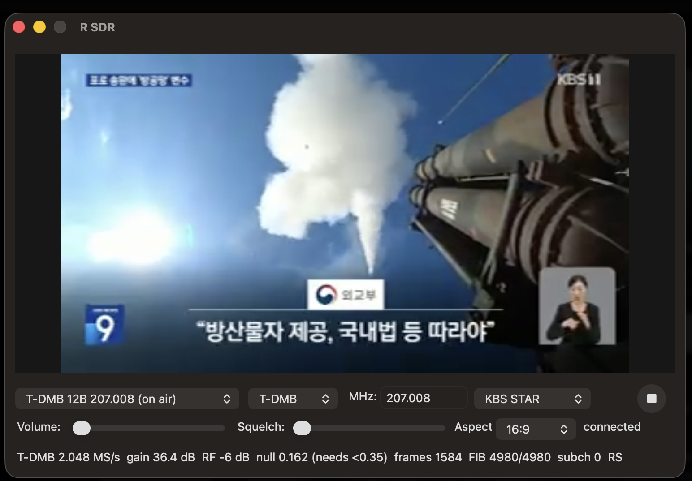

#  R SDR for macOS

*[한국어](README.ko.md) · [Documentation index](../README.md)*



## Installation

Install the build dependency with Homebrew, then build and install the app:

```sh
brew install librtlsdr
cd macos
make
make install
```

This installs `/Applications/R SDR.app`. The installed app bundle includes its
RTL-SDR runtime libraries, so Homebrew is not required merely to run the app.

To use authorized DVB-CSA control words with a restricted T-DMB service,
install the optional library before building:

```sh
brew install libdvbcsa
```

Clear T-DMB services do not require this library.

## Usage

1. Connect an RTL2832U-compatible dongle before opening R SDR.
2. Select a Preset, or select a Mode and enter a frequency. AM frequencies are
   entered in kHz; all other modes use MHz.
3. Press Play, then adjust Volume. Squelch is available in AM, Air, LSB, and
   USB modes; move it fully left to disable it.
4. In WFM mode, enable Stereo only when the signal is strong enough for stable
   reception. Click the spectrum or waterfall to tune to that frequency.
5. For T-DMB, select an on-air T-DMB preset and wait while automatic gain and
   Station detection finish. Select a station, then press Play. Use Aspect to
   switch video between 16:9 and 4:3.

Below 28.8 MHz, the app automatically switches to Q-branch direct sampling.
Reception in this range requires a dongle whose Q input is connected to the
antenna or exposed as a separate HF input.

If the dongle disconnects, reconnect it and wait for the controls to become
available. Playback does not restart automatically; press Play when ready.

### Restricted T-DMB services

If you are authorized to use DVB-CSA control words, install `libdvbcsa`, then
open **R SDR > DMB Control Words…**. Enter an even and/or odd control word as
12 or 16 hexadecimal digits; spaces, colons, and hyphens are accepted. Control
words remain in memory for the current run and are not saved.

Alternatively, set `RSDR_DMB_EVEN_CW` and `RSDR_DMB_ODD_CW` before launching
the app. Descrambling is disabled when both values are blank.

## License

R SDR's original source code is licensed under the [MIT License](../LICENSE).
Bundled components under `third_party/` retain their own licenses and are not
relicensed under MIT. See the [third-party notices](../THIRD_PARTY_NOTICES.md)
for details.

## AI disclosure

Parts of R SDR were developed with the assistance of AI coding tools
(Anthropic's Claude). All code has been reviewed and tested by the author.
